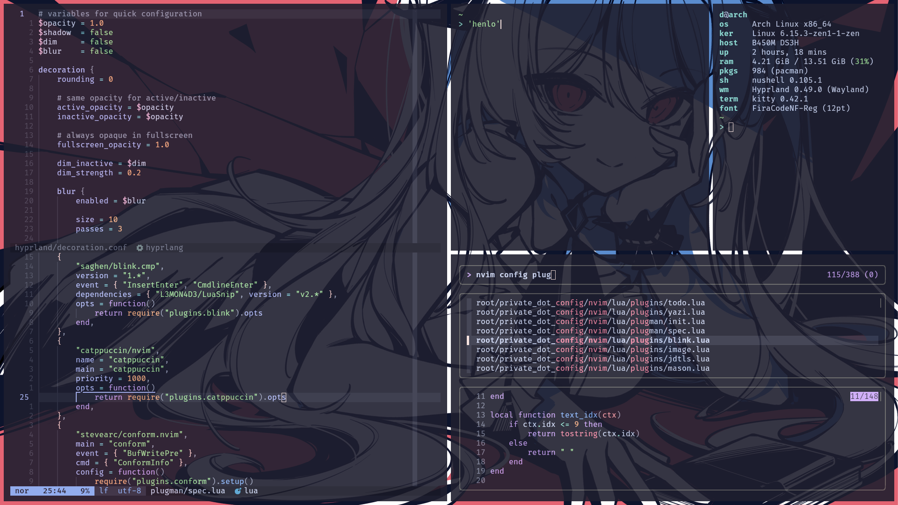

# dotfiles

My configuration for Arch Linux, managed by [chezmoi](https://www.chezmoi.io/).



## Description

Every configuration is designed specifically for me and always could change.

Briefly about the configuration:

| Component    | Project                                        |
| ------------ | ---------------------------------------------- |
| Theme        | Catppuccin (Mocha)                             |
| Font         | Fira Code (terminal) / Noto Sans Mono (Waybar) |
| Compositor   | Niri (Wayland)                                 |
| Task bar     | Waybar (with cava)                             |
| Shell        | Nushell (primary) & zsh (login, secondary)     |
| Terminal     | kitty                                          |
| Editor       | Neovim                                         |
| File manager | Yazi (TUI) / Nautilus (GUI)                    |
| Music        | mpd + rmpc                                     |

Screenshots can be viewed in configurations' README's. The wallpaper used in all
images is from
[The NOexistenceN of you AND me](https://store.steampowered.com/app/2873080/The_NOexistenceN_of_you_AND_me/).

## Configurations

The configurations for applications I don't use are not going to be updated. You
can call them "archived". But this state is not permanent if I start using the
app again.

Archived state doesn't mean that these configurations are invalid, but you
should be aware that they could be outdated.

Shoutout to all projects I used. Even if I don't use them anymore, they are
awesome. Check them out.

| Module                                                    | Archived | Notes                           |
| --------------------------------------------------------- | -------- | ------------------------------- |
| [bat](https://github.com/sharkdp/bat)                     | no       |                                 |
| [btop](https://github.com/aristocratos/btop)              | no       |                                 |
| [cava](https://github.com/karlstav/cava)                  | no       |                                 |
| [delta](https://github.com/dandavison/delta)              | no       |                                 |
| [dunst](https://github.com/dunst-project/dunst)           | no       |                                 |
| [fastfetch](https://github.com/fastfetch-cli/fastfetch)   | no       |                                 |
| [fd](https://github.com/sharkdp/fd)                       | no       |                                 |
| [fzf](https://github.com/junegunn/fzf)                    | no       |                                 |
| [Git](https://git-scm.com)                                | no       |                                 |
| [Helix](https://helix-editor.com)                         | **yes**  |                                 |
| [hyprwm](https://github.com/hyprwm)                       | **yes**  | [README](./docs/hyprwm.md)      |
| [Kanata](https://github.com/jtroo/kanata)                 | no       |                                 |
| [kitty](https://github.com/kovidgoyal/kitty)              | no       | Tied to Neovim configuration.   |
| [Kvantum](https://github.com/tsujan/Kvantum)              | no       |                                 |
| [lazydocker](https://github.com/jesseduffield/lazydocker) | no       |                                 |
| [lazygit](https://github.com/jesseduffield/lazygit)       | no       |                                 |
| [lf](https://github.com/gokcehan/lf)                      | **yes**  |                                 |
| [mpd](https://www.musicpd.org/)                           | no       | Music directory is `~/Music`.   |
| [Nushell](https://www.nushell.sh)                         | no       |                                 |
| [Neovim](https://neovim.io)                               | no       | [README](./docs/nvim.md)        |
| [Oh My Posh](https://ohmyposh.dev)                        | no       |                                 |
| [pacman](https://pacman.archlinux.page)                   | no       | `/etc` config not included yet. |
| [GnuPG](https://gnupg.org)                                | no       |                                 |
| [rmpc](https://mierak.github.io/rmpc)                     | no       | [README](./docs/rmpc.md)        |
| [Waybar](https://github.com/Alexays/Waybar)               | no       | Needs `waybar-cava` package.    |
| [Wofi](https://sr.ht/~scoopta/wofi)                       | **yes**  |                                 |
| [yazi](https://yazi-rs.github.io)                         | no       |                                 |
| [zsh](https://www.zsh.org/)                               | no       |                                 |

## Installation

Installation from the get-go in the current repository state haven't been
tested. I started this repository without an initial reproducibility goal in
mind, and only now I am chasing this feature (at least, to some extent).

chezmoi supports only one user, and it's the case here as well. Multiple hosts
are supported (hopefully). The only supported OS right now is Arch Linux
(scripts are checking this).

### Full

Automatic `chezmoi init` installation is not recommended right now. You could
try, but the issue is the hosts: you should add your own host to
`.chezmoidata/hosts.yaml`. After that `chezmoi init` should work.

For using this approach, I would recommend these steps:

1. Back up your current configuration
2. Clone the repository to `~/.local/share/chezmoi`
3. Edit `hosts.yaml` to include your host
4. `chezmoi init`
5. `chezmoi apply`

You should be aware that this setup will be pretty hard to uninstall. It will
execute many scripts for the system-wide and user-wide changes, so even if you
can revert the files to their original state, the system changes are still here.
It's mostly for new machines (because you just can reinstall the system) and for
me.

### Partial

The recommended approach for now.

Clone the repository with:

```sh
git clone https://github.com/shimeoki/dotfiles.git
```

and grab the configurations you need and apply them manually. That's it.

This way no scripts are ran and no templates are executed, but the system is
safe. If you find a `.tmpl` file, replace the `{{ ... }}` with your data.

## How to use

This configuration mostly focuses on navigation and terminal usage.

Where possible, apps use vi-style bindings. Three main "layers" are:

- Window compositor
- Terminal
- Editor (or other TUI application)

These apps use splits for the space management and navigation. Bindings are
usually the same or very similar. The difference is the modifier key:

| Application     | Mod                 |
| --------------- | ------------------- |
| niri / Hyprland | Super (Windows key) |
| kitty           | Alt                 |
| Neovim          | Ctrl                |

So it's not adviced to change any modifiers because of the hierarchy. For
example, use Alt for the compositor as well, because it would break terminal
shortcuts. If you changed one mod key, change others appropriately.

With the default "layout":

- compositor can use Shift, Ctrl and Alt,
- terminal can use Shift and Ctrl
- and editor can use Shift

as additional modifiers.

This way, left hand is reserved for the modifier combinations and right hand is
used for the bindings (mostly window control).

The other important aspect is the searching. The configuration uses two main
ways:

- fzf-style
- yazi-style

For example, if the file is located pretty deep and you only need to find it,
you use fzf. But if you need to do some actions with the file and it's pretty
close, you use yazi. If needed, you just combine two methods: go to the needed
directory with fzf and then do the stuff with yazi.

Of course, traditional method of cd'ing and cp'ing manually is not gone. But
it's mostly used in scripts or restricted environment (elevated privileges like
system-wide configuration). Usually, if you find yourself just typing the path
manually, you are doing something wrong.

Because of this, fzf is deeply integrated in Nushell, zsh, niri (window focus)
and Neovim (telescope). Yazi is used as the main file manager (by itself and in
Neovim - no file tree).

Window management is escalated to another level thanks to overview in niri.
Mouse is the preferred method for arranging windows and navigating between them.
You can also use the keyboard on a laptop, if you prefer. Mouse is recommended,
because you use a browser while you work anyway, and dragging the windows with a
pointer is more intuitive.

Aside from the navigation, space management and searching, the configuration
tries to be minimal to my liking. For example, they are mostly no tab bars and
Waybar is turned off by default, so it's expected that you would toggle it on
demand. Also, there are no fancy widgets and not too much eye-candy.

## Contributing

Although this is my personal configuration, it's great to share your setups and
workflows to other people, so contributions, bug reports and questions are
welcomed.

## License

This repository contains code from other people. If it's possible, I specify a
source link. All rights go to the respective authors, and check their license
(if present) before usage.

If the source is not specified, then it's either my own code or I couldn't
specify a source. Example of the latter situation is all Catppuccin theme files
in the repository.

My own code is licensed under the license in repository root. This license
doesn't "override" other licenses in situations described above.
