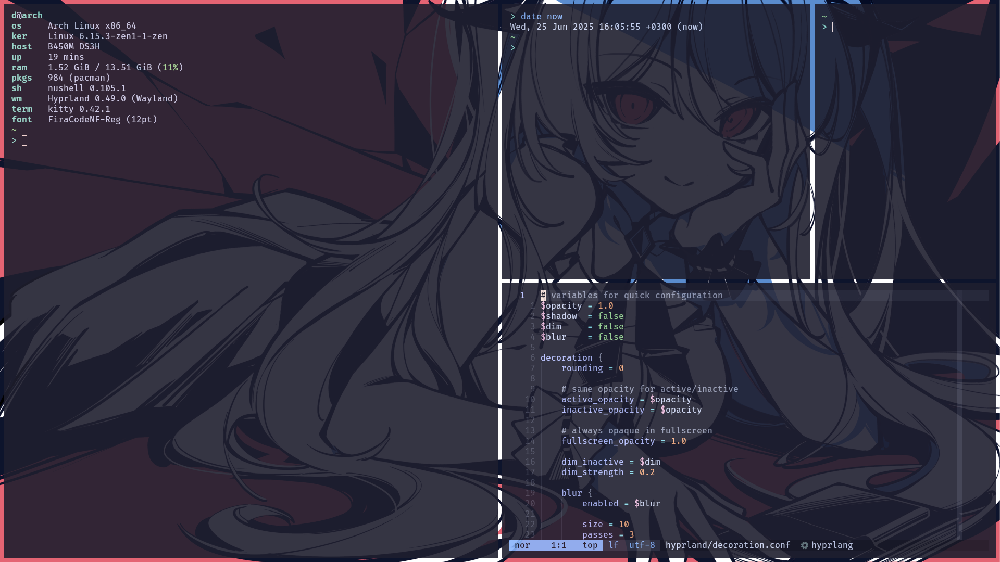
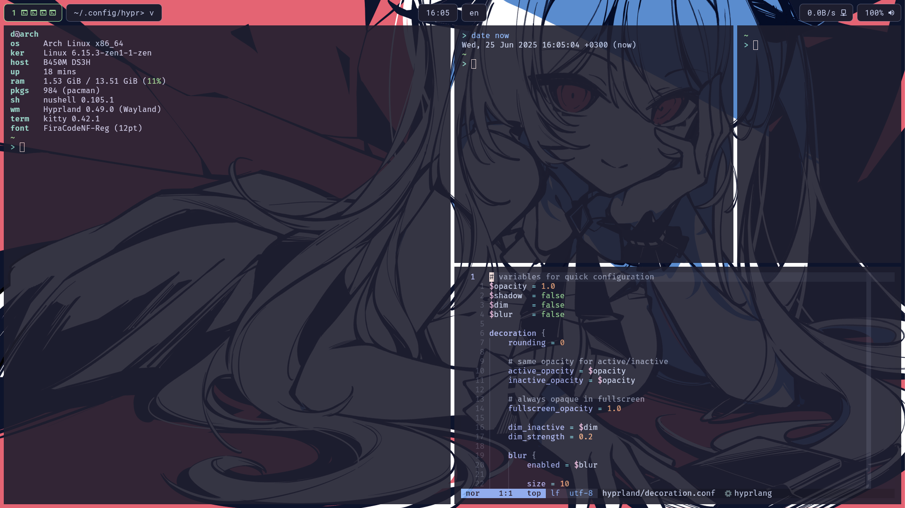
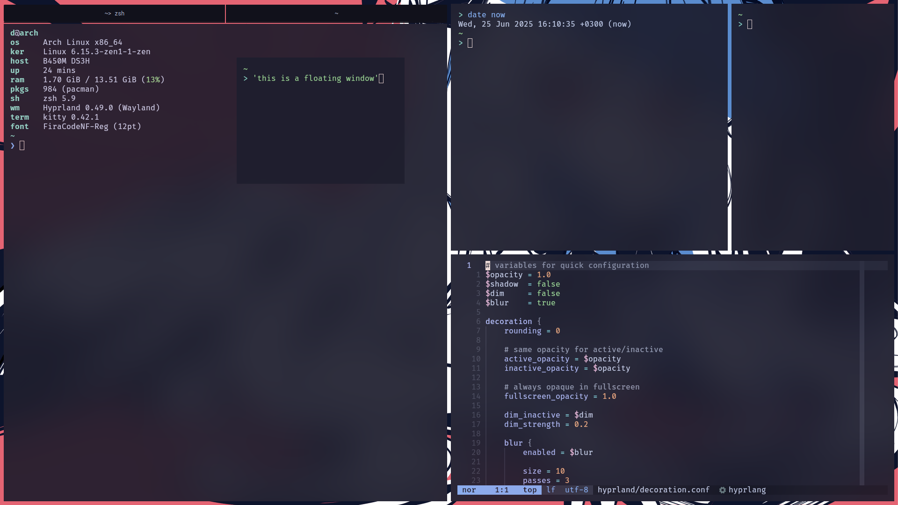
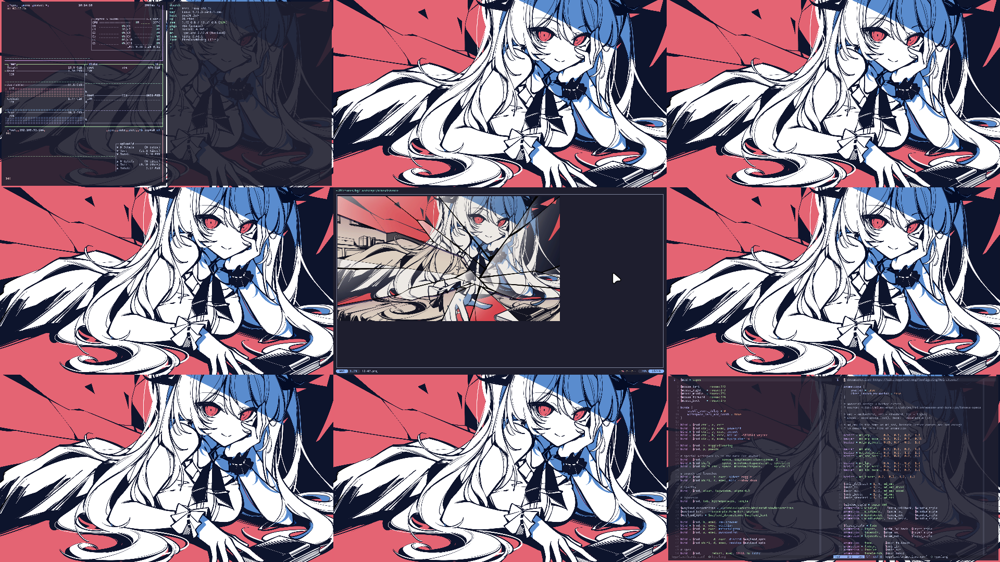

# hyprwm

Many projects from the hypr ecosystem are configured:

- Hyprland
- Hyprlock
- Hypridle
- Grimblast
- Hyprpicker

Although I don't use Hyprland anymore, the configuration is still partly
supported and maintained.

## Showcase

The config is very simple. Mostly I don't even use a taskbar (Waybar).
Nevertheless, there are some images as the reference for gaps, terminal
transparency, overall look and feel.

On the screenshot above fastfetch is opened on the left, and Neovim on the right
with the screenshot's Hyprland configuration.

In comparison to the previous screenshot, this has Waybar enabled. But Waybar
now looks a little different (with no rounding and borders, colors and layout
are the same), but previous configuration could be easily remade.

The configuration changed: this has blur enabled. Also, bar for grouped windows
and a floating windows are present.

With Waybar disabled, hyprexpo plugin is my main method of navigation between
workspaces to see them visually. 1st has two terminals open with btop and
fastfetch, 5th has one terminal in a fullscreen mode with yazi opened (and yazi
itself is previewing a fullscreened image), and 9th has Neovim open.
