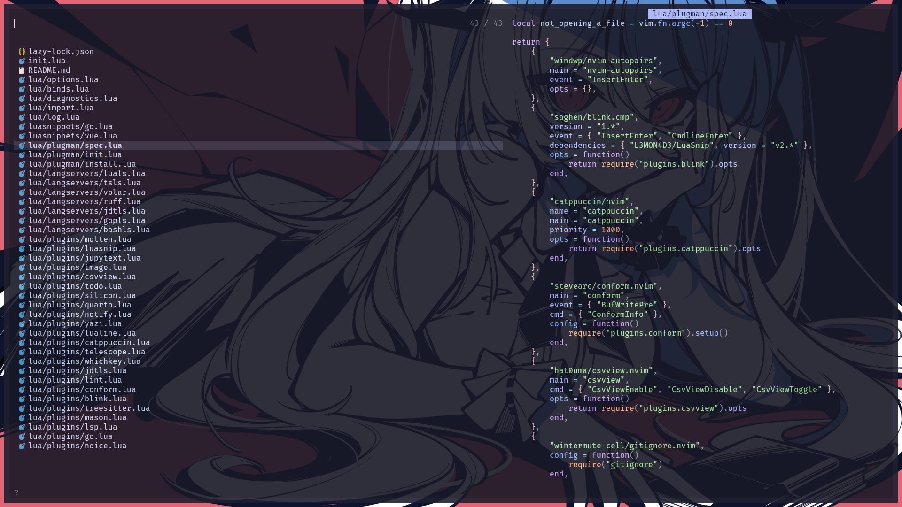
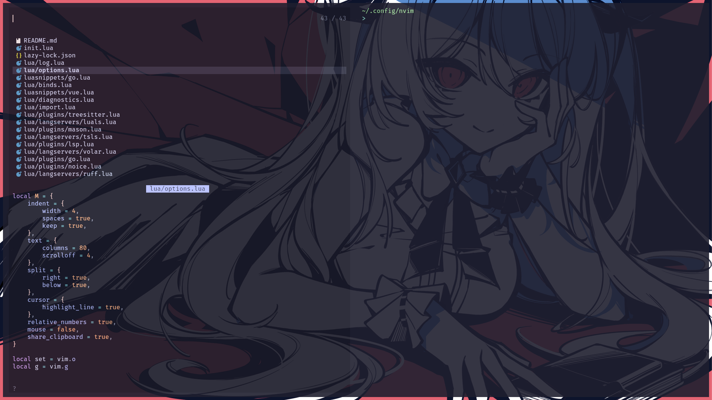
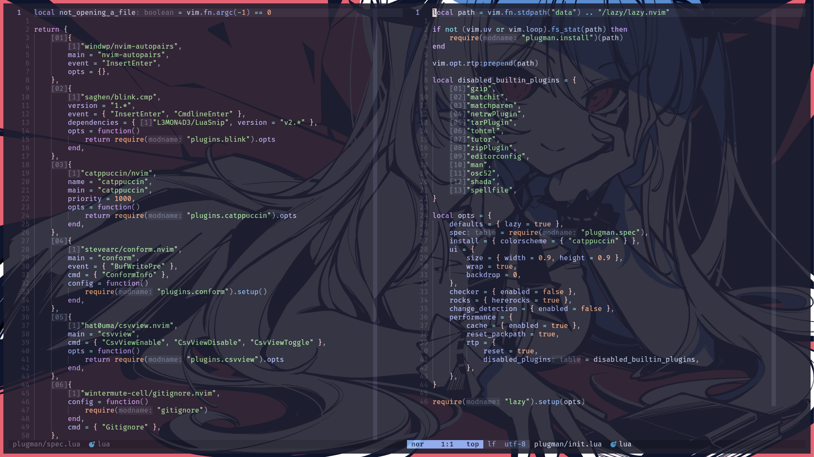
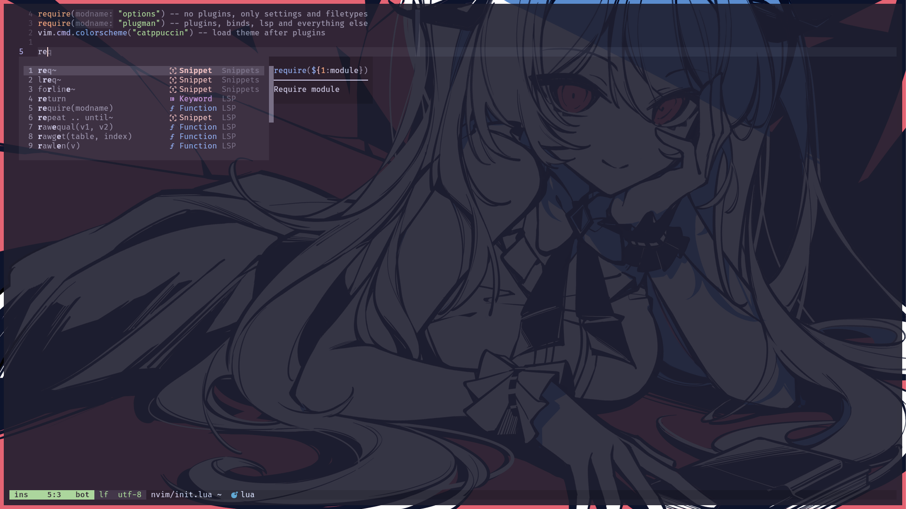
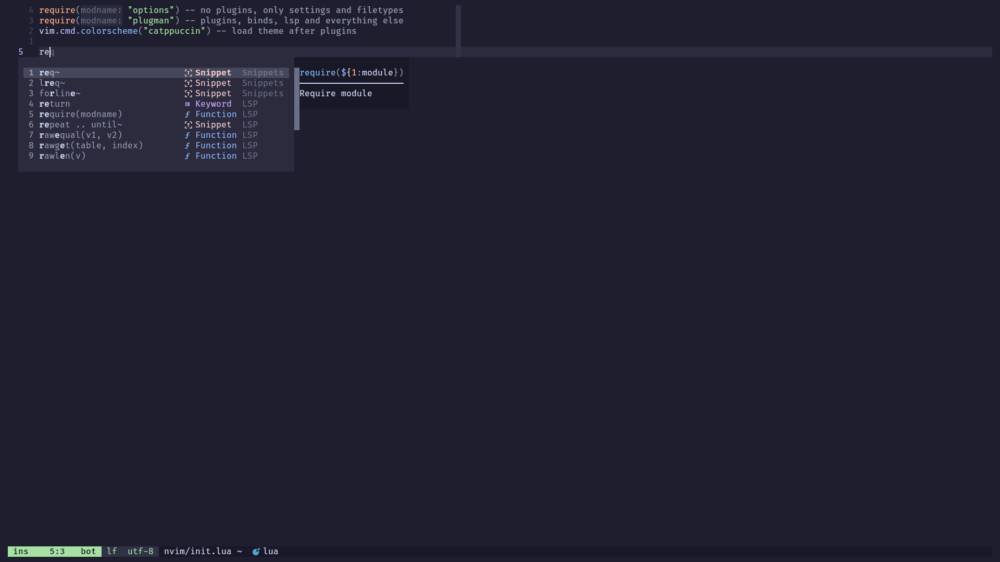
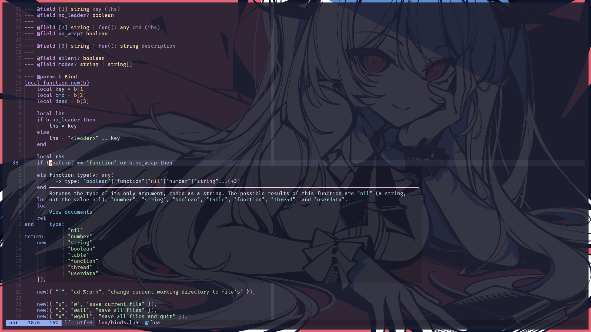
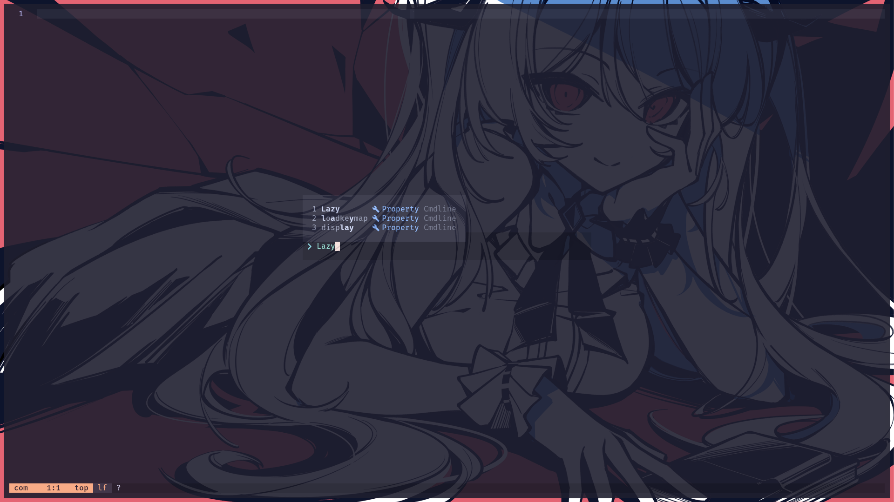
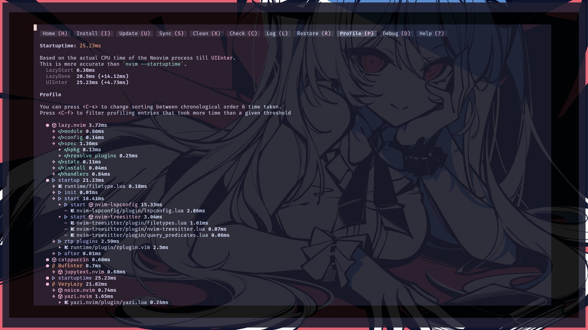

# Neovim

The documentation can be outdated. If that's the case, consider opening an
issue.

## Description

Features:

- Uses [lazy.nvim](https://lazy.folke.io/) as the plugin manager.
- Lazy-loads almost every plugin, resulting in <20 ms startup time with no
  buffers opened (on SSD with no encryption).
- Uses [Catppuccin](https://github.com/catppuccin/nvim) as the colorscheme.
- Used plugins can be viewed in `lua/plugman/spec.lua`.

This setup is aimed not to give an IDE experience. It is aimed to have a
minimalistic setup with modern features for usage both as a simple editor for
configs and as a VS Code lightweight analogue for programming.

Because of that, LSP, linting, formatting, syntax highlighting, snippets,
telescope and more are configured, but bufferline or "explorer as a tree"
plugins are not present. Maybe it is pretty handy to have them, but I tried to
minimize the plugin count.

I made this config, obviously, for me, so many things can be not convenient for
others. For example, all of the binds are in format "space + key", where "key"
is not a sequence, but a single key with optional modifier (shift or ctrl). I
avoided the "sequence of keys" binds, but it is probably inevitable, can could
be changed in the future. And as noted above, there is no "explorer as a tree"
or bufferline, so yazi/telescope and telescope buffers are used instead.

## Showcase

The showcase screesnhots were taken while using Hyprland, but the overall
appearance hasn't changed since then.

My configuration doesn't have a fancy greeter plugin, and furthermore, disables
default Neovim greeter, so you have this view at the start. At the bottom
lualine can be seen. `?` refers to a new buffer, when a file wasn't written to a
disk yet.

Telescope is the main tool for navigation in a pair with yazi plugin. Right now
it looks like this.

When the width of the window is not sufficient, Telescope has alternative
layout. I tuned this value to trigger at the terminal split in half.

Buffers split horizontally look like this. Inactive buffers have different
lualine styling. Also, inlay hints are present.

Completions look like this.

The popup color is not very contrast, so maybe you want to fullscreen the
terminal or disable transparency.

There is a symbol info popup in a buffer with inlay hints disabled.

Command line is not the default, and not the Noice plugin default, to match
other popups. Also, completions are present. Preselect is not enabled, so input
is untouched before Ctrl+j or Ctrl+k.

Startup time was less before treesitter and lspconfig updates (because almost
every plugin is lazy-loaded), but even now on a SSD with no encryption on Ryzen
5 5600G startup averages 25-26ms.

## Requirements

- Last Neovim version (0.11.0+).
- Git.
- [kitty](https://github.com/stevearc/conform.nvim) as the terminal emulator.
- System-wide Go and Rust installations, with their respective "package
  installation paths" added to the `PATH` environment variable.
- For Jupyter Notebook, Python environment should be configured:
  - `VENV_HOME` should be set.
  - Python virtual environment with name `nvim` should be present in
    `VENV_HOME`.
  - Other instructions can be found in
    [molten-nvim](https://github.com/benlubas/molten-nvim) documentation
    (probably can be added here in the future).
- For screenshots, [silicon](https://github.com/Aloxaf/silicon) should be
  installed (system-wide package or cargo crate is on your part, just should be
  available in `PATH`).
- For kitty integration, corresponding remote control configuration should be
  present (check the kitty/ directory in the repository).

## Issues

- Jupyter Notebook setup is not very convenient, and requires to activate a venv
  before launching Neovim.
- Many actions are not mapped to a key.
- Many things are not polished.
- Debugging is only "configured" for Go.

## Structure

To minimize the load time, everything that is not required to be read at the
startup is separated to a different file to `require()` it later.

- `lua/options.lua` is a file which does not depend on plugins. It is all
  mandatory configuration with "vanilla" Neovim features and should always be
  loaded.
- `lua/plugman/` is a directory with `lazy.nvim` setup. All plugin
  specifications should be listed in `lua/plugman/spec.lua`.
  - No plugin settings or options should be present in `spec.lua`. If a plugin
    requires more than a simple `setup()` call, a separate file should be
    created in `lua/plugins/` to `require()` the configuration in wrapper
    function.
  - Plugin manager is configured in `lua/plugman/init.lua`.
- `lua/langservers/` is a directory with all custom configs for
  `nvim-lspconfig`. They are used in `lua/plugins/lsp.lua`.
- Linting configuration can be found in `lua/plugins/lint.lua` and formatting in
  `lua/plugins/conform.lua`.
- `luasnippets/` is a directory for all custom
  [LuaSnip](https://github.com/L3MON4D3/LuaSnip) snippets. They are loaded
  automatically, and the syntax as well the documentation can be found
  [here](https://github.com/L3MON4D3/LuaSnip/blob/master/DOC.md#lua).
