# Showcase

The wallpaper used in all following images is from
[The NOexistenceN of you AND me](https://store.steampowered.com/app/2873080/The_NOexistenceN_of_you_AND_me/).

Right now only images are present. Because of that, crucial parts (such as
animations in Hyprland config) are missing.

## Hyprland

Hyprland config is very simple. Right now I don't even use a taskbar (Waybar).
Nevertheless, there are some images as the reference for gaps, terminal
transparency, overall look and feel.

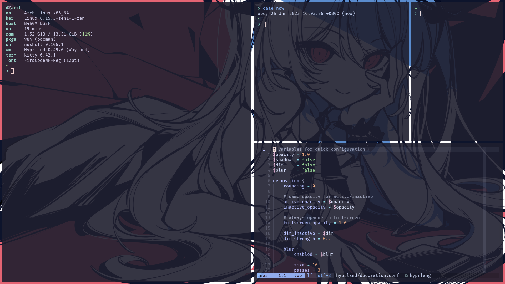

On the screenshot above fastfetch is opened on the left, and Neovim on the right
with the screenshot's Hyprland configuration.

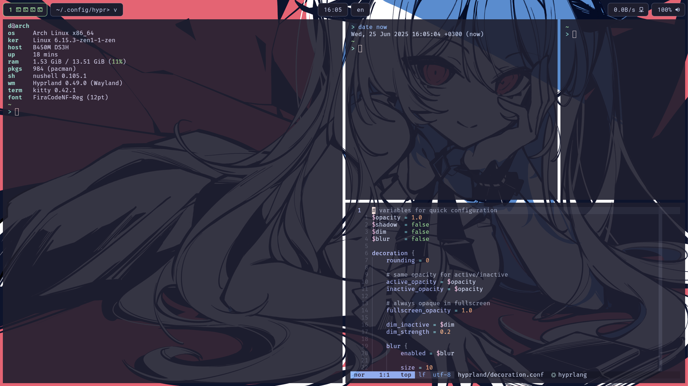

In comparison to the previous screenshot, this has Waybar enabled.

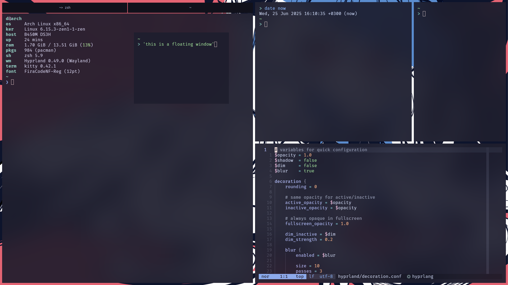

The configuration changed: this has blur enabled. Also, bar for grouped windows
and a floating windows are present.

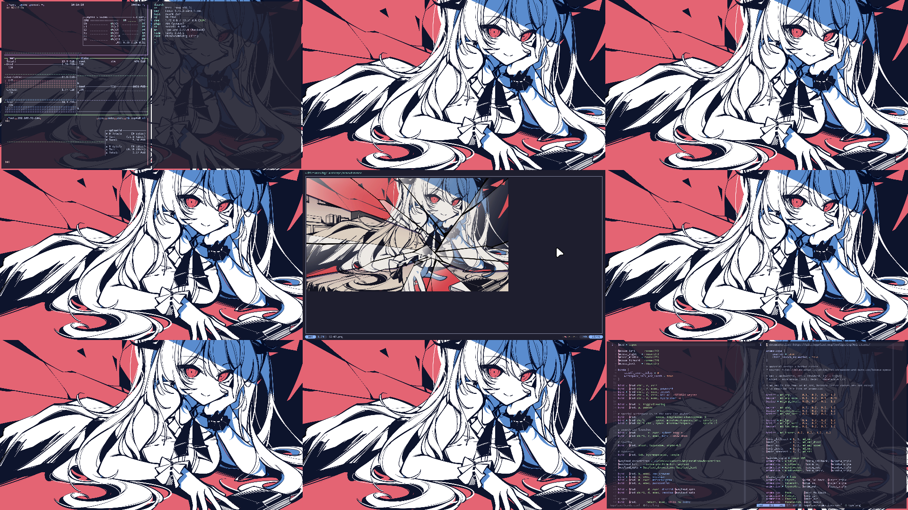

With Waybar disabled, hyprexpo plugin is my main method of navigation between
workspaces to see them visually. 1st has two terminals open with btop and
fastfetch, 5th has one terminal in a fullscreen mode with yazi opened (and yazi
itself is previewing a fullscreened image), and 9th has Neovim open.

## Neovim

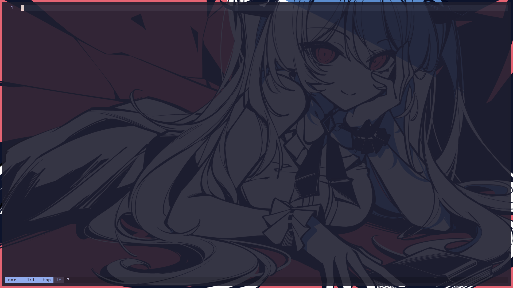

My configuration doesn't have a fancy greeter plugin, and furthermore, disables
default Neovim greeter, so you have this view at the start. At the bottom
lualine can be seen. '?' refers to a new buffer, when a file wasn't written to a
disk yet.

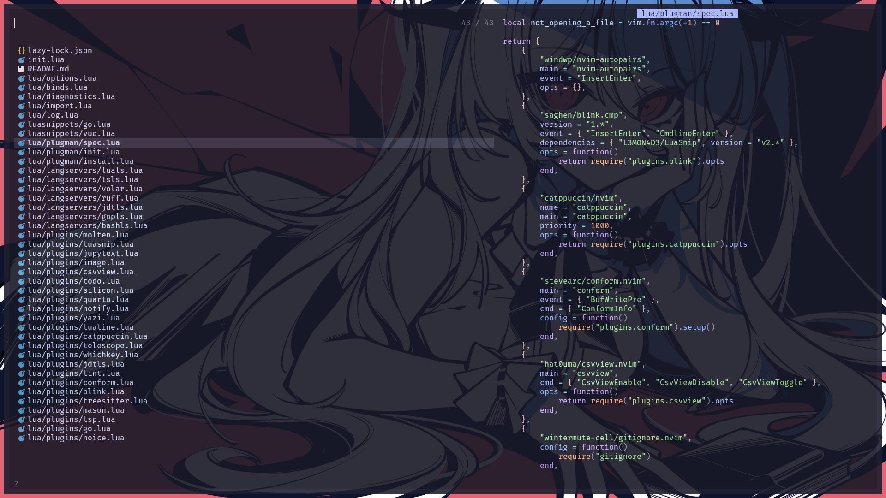

Telescope is the main tool for navigation in a pair with yazi plugin. Right now
it looks like this. Also, the syntax highlighting in preview is broken (probably
because of the new treesitter, and I need to change something).

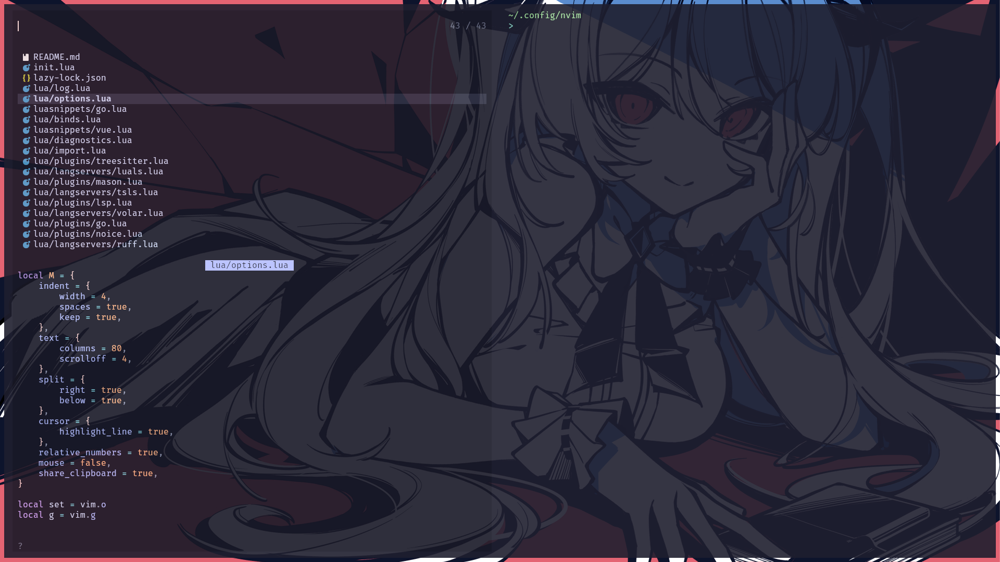

When the width of the window is not sufficient, Telescope has alternative
layout. I tuned this value to trigger at split terminal in half.

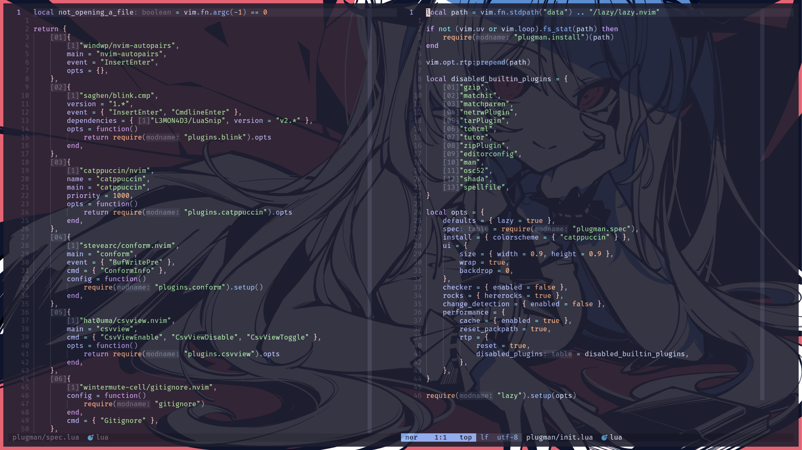

Buffers split horizontally look like this. Inactive buffers have different
lualine styling. Also, inlay hints are present.

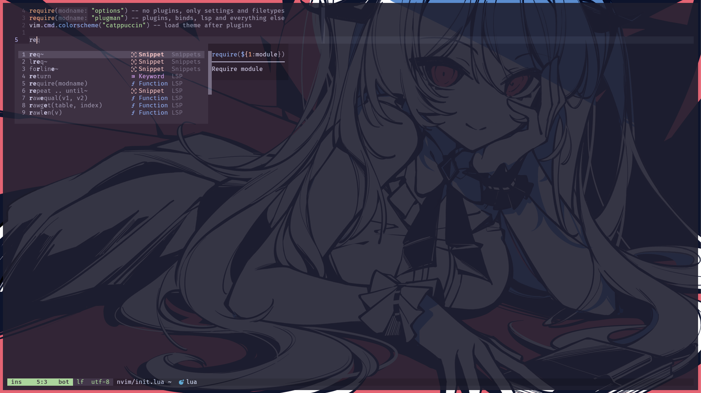

Completions look like this.

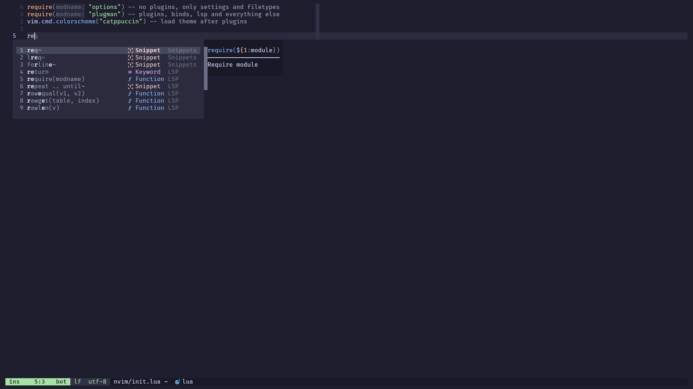

The popup color is not very contrast, so maybe you want to fullscreen the
terminal or disable transparency.

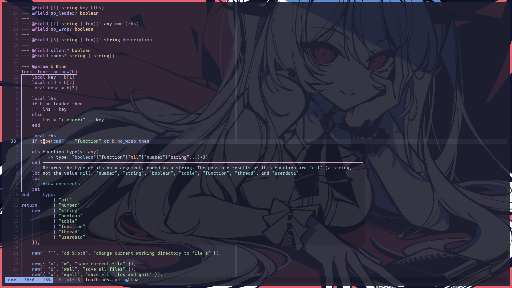

There is a symbol info popup in a buffer with inlay hints disabled.

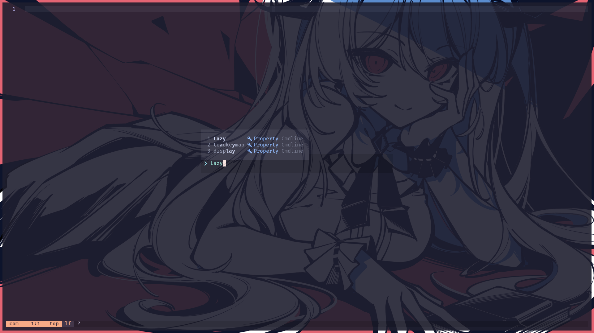

Command line is not the default, and not the Noice plugin default, to match
other popups. Also, completions are present. Preselect is not enabled, so input
is untouched before Ctrl+j or Ctrl+k.

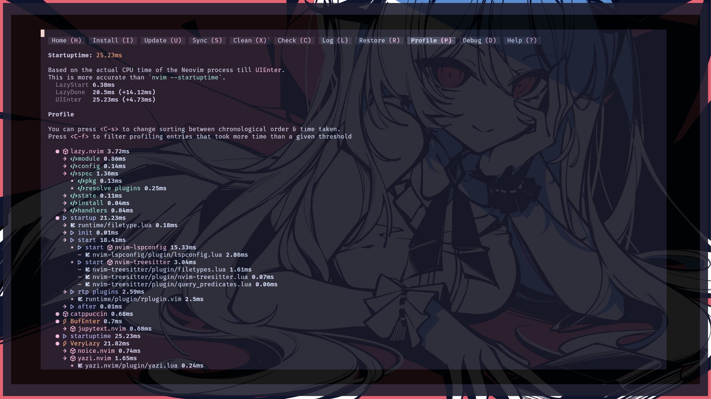

Startup time was less before treesitter and lspconfig updates (because almost
every plugin is lazy-loaded), but even now on a SSD with no encryption on Ryzen
5 5600G startup averages 25-26ms.

## Shell

Right now, I mainly use Nushell, but Zsh is also still supported. Below are some
differences and just visuals for the shells.

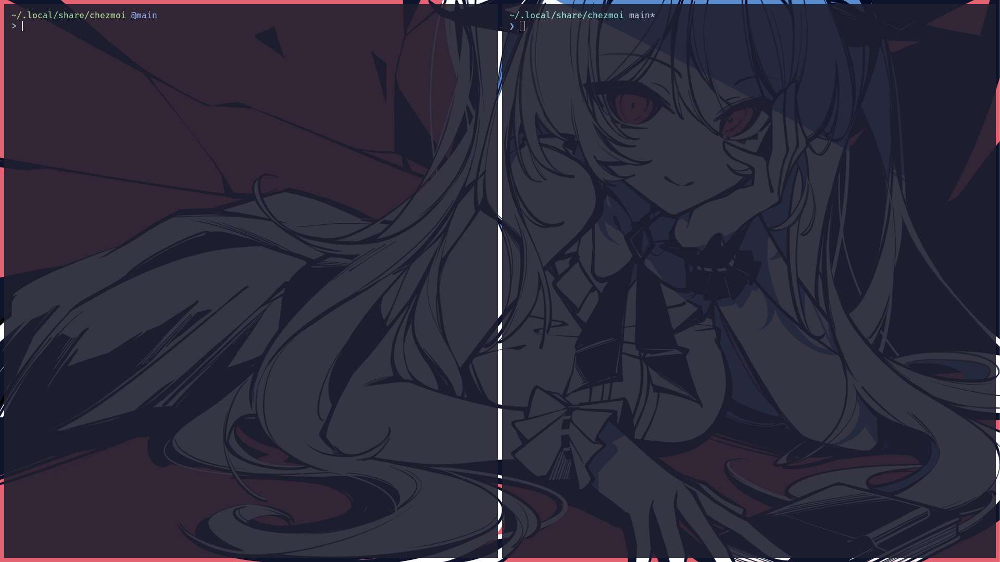

Git prompts are very simple. Nushell one is self-made and only shows current
branch, while Zsh shows branch status as well (are there new files in the index
or not), powered by Oh My Posh.

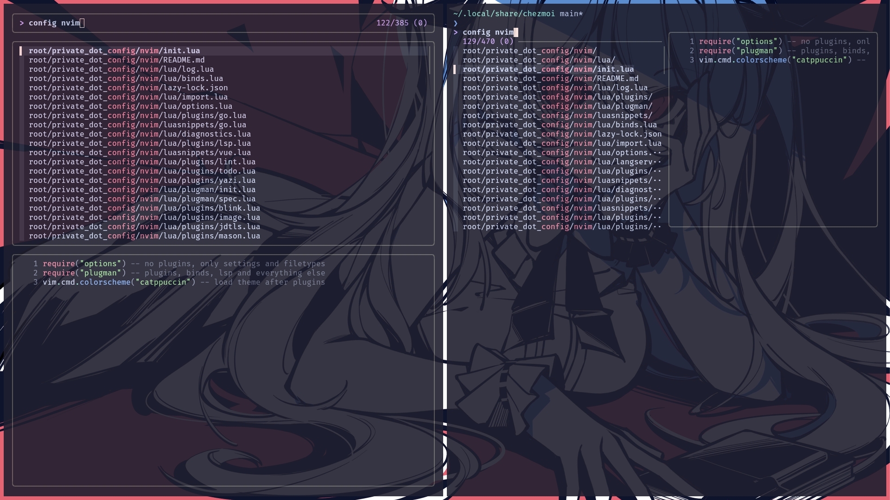

Zsh uses built-in fzf integration, while Nushell uses custom binds. My custom
bind doesn't include directories while opening something with fzf, so output is
different. Nushell has custom vertical layout (like Telescope in Neovim).

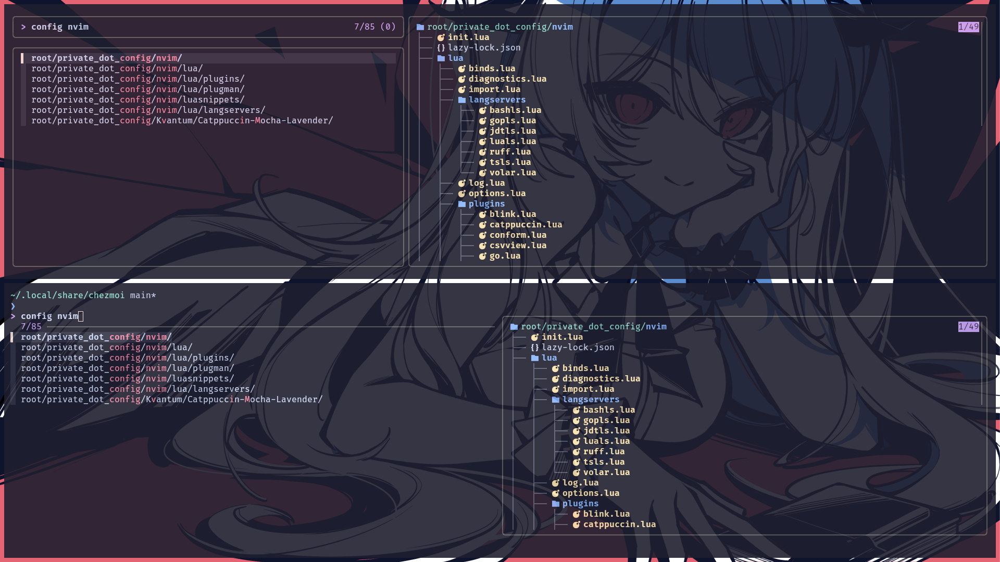

And one more example with different split and mode for changing CWD.
